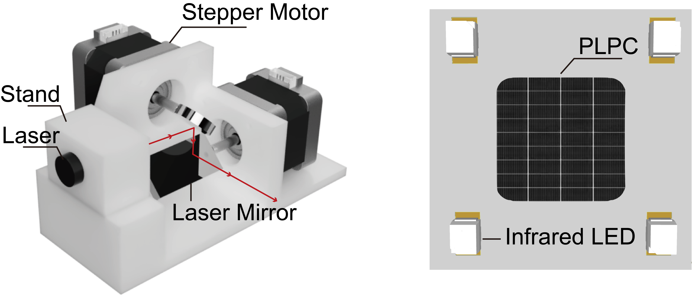
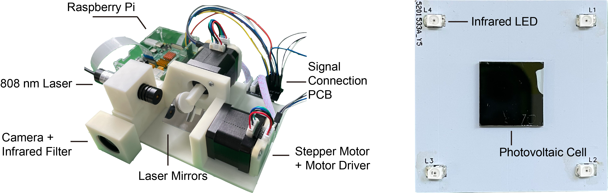
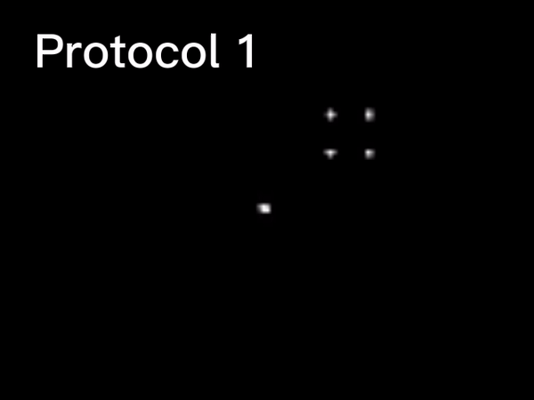
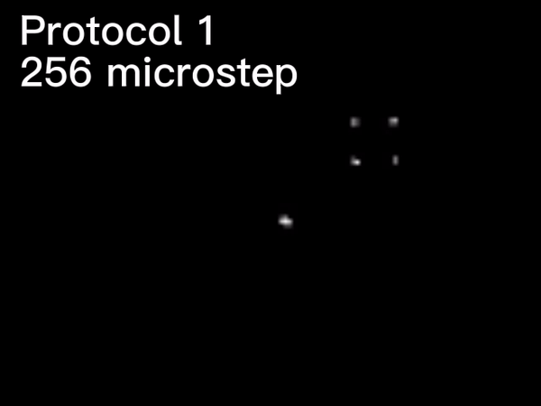
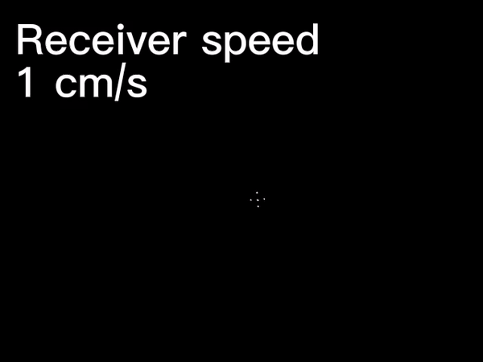
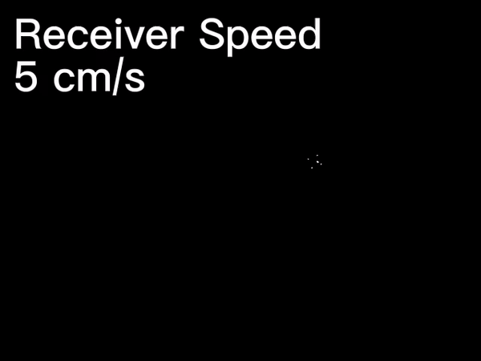
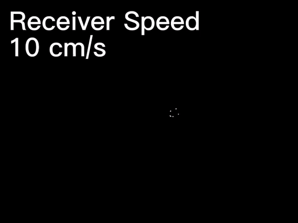

# Receiver Positioning and Beam Steering

NEWS: 🔥Our paper is accepted by iScience!🔥

[Design principles and implementation of receiver positioning and beam steering for laser power transfer systems](https://www.cell.com/iscience/fulltext/S2589-0042(23)02259-9)

Minshen Lin, Wenxing Zhong


[](https://github.com/WPT-Lab124/Receiver-Positioning-and-Beam-Steering)


This project is the implementation of our proposed scheme of receiver positioning and beam steering for laser power transfer systems. With the hardware design models and the source code, you can replicate the findings in our paper and explore new ideas and schemes based on the current design. If you require any further information or if we can be of any assistance, feel free to contact us by creating an [issue](https://github.com/WPT-Lab124/Receiver-Positioning-and-Beam-Steering/issues) or sending us emails.




This project includes:
- source code (in Python) that implements the functionalities and the experimental protocols
- 3D-printing models (STL files) for the mechanical design
- PCB design for the receiver
- experimental results in video form
- bill of materials

## Project structure
```
├── Code
│   ├── main.py                       <- main file implementing the control logic described in the paper
│   ├── protocol_1.py                 <- file for experimental protocol 1
|   ├── protocol_2.py                 <- file for experimental protocol 2
│   └── Utils
│   │   ├── PID.py                    <- PID controller class
│   │   ├── ReceivedPoints.py         <- class for discerning the receiver from the captured 5 points
│   │   ├── StepperMotor.py           <- motor controller class
│   │   └── tracker.py                <- tracker class
├── Hardware                          <- hardware design models
│   ├── 3D-Printing Models
│   └── Printed Circuit Board
├── Assets                            <- images and experimental videos for the protocols
│   ├── Images
│   └── Videos
├── LICENSE.md 
└── README.md
```

## Preparation
- To get started, you need to have two stepper motors, two motor controllers, Raspberry Pi 4B with Camera module v2 (or other computers and cameras, but the code needs modification), an infrared filter, an infrared laser (e.g., 100 mW, 808nm), and two laser mirrors.
- Manufacture the 3D-printing models and the PCB, and assemble everything.
- Set up the Python environment on Raspberry Pi. See [Ref](https://www.youtube.com/watch?v=QzVYnG-WaM4&t=2s).
- Download the code on your Raspberry Pi.
- Test the system performance with `main.py`, `protocol_1.py`, or `protocol_2.py`.

A photo of the implementation is shown in the following image. The photovoltaic (PV) cell is manufactured by our collaborators, but you can use the receiver without PV cells because it has negligible influence on the intensity of the laser spot beamed at the receiver.



## Experimental Videos
### Protocol 1
***With 16 microstepping***



Parameters: the distance between the transmitter and the receiver is 2 m; the initial distance between the receiver and the laser spot is 10 cm.

***With 256 microstepping***



### Protocol 2
***With 1 cm/s receiver speed***



***With 5 cm/s receiver speed***



***With 10 cm/s receiver speed***



## Bill of Materials
For researchers in China, you can purchase the components in the following links:
- [Stepper Motor](https://item.taobao.com/item.htm?spm=a1z09.2.0.0.52632e8d1TXj6z&id=600124844336&_u=528s2ekd5bd1)
- [Motor Controller](https://item.taobao.com/item.htm?spm=a1z09.2.0.0.52632e8d1TXj6z&id=673302946671&_u=528s2ekd75e7)
- [Raspberry Pi 4B](https://item.taobao.com/item.htm?spm=a1z09.2.0.0.52632e8dekqXXo&id=596761703325&_u=528s2ekdece8)
- [Raspberry Pi Camera Module v2](https://item.taobao.com/item.htm?spm=a1z09.2.0.0.52632e8dekqXXo&id=531388836999&_u=528s2ekdae12)
- [Infrared Filter](https://item.taobao.com/item.htm?spm=a1z09.2.0.0.52632e8d39Q22d&id=41482304810&_u=528s2ekdcfbc)
- [Infrared Laser](https://item.taobao.com/item.htm?spm=a1z09.2.0.0.52632e8d1TXj6z&id=597192207671&_u=528s2ekd5970)
- [Laser Mirror (circular)](https://item.taobao.com/item.htm?spm=a1z09.2.0.0.52632e8d1TXj6z&id=586249224446&_u=528s2ekddfc6)
- [Laser Mirror (rectangular)](https://item.taobao.com/item.htm?spm=a1z09.2.0.0.52632e8d1TXj6z&id=577756381316&_u=528s2ekdd99e)
- [PCB Manufacturing](https://www.jlc.com/)
- [3D Printing](https://www.sanweihou.com/)

For researchers outside China, you can purchase similar components on other platforms.

If we can be of any assistance or if you require any further information, feel free to contact us.

## Citation
If you find this work useful in your research, please cite:
```
@article{lin2023design,
  title={Design principles and implementation of receiver positioning and beam steering for laser power transfer systems},
  author={Lin, Minshen and Zhong, Wenxing},
  journal={Iscience},
  volume={26},
  number={11},
  year={2023},
  publisher={Elsevier}
}
```

## Other Info.
Author: Minshen Lin and Wenxing Zhong

Email: linminshen@zju.edu.cn, wxzhong@zju.edu.cn

Institution: Zhejiang University
